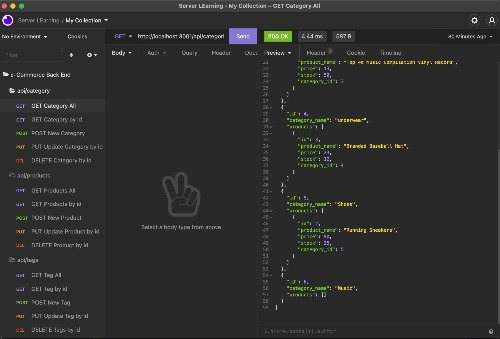

# e-commerce-back-end
## Lauren Darrimon
    
    
### Description
Back end for an e-commerce site using Express.js API and Sequelize to interact with a MySQL product database.

### [Watch Video Walkthrough](https://drive.google.com/file/d/1QSdXeAA9331ve5gUgdb4ECrvpH8XlLGY/view?usp=sharing)

### Table of Contents

* [Link](#link)
* [Installation](#installation)
* [Usage](#usage)
* [Contributing](#contributing)
* [Questions](#questions)
* [License](#license)

### Link 
🔗 
Link to application [e-commerce-back-end](https://github.com/LaurenDarrimon/e-commerce-back-end)

### Installation
🔧
In order for this application to work, you need to install the following (dependencies): 
Node.js, Express.js, MySQL2, Sequelize, and dotenv.  

After you clone down the repository, install dependencies from the root directory. 

~~~
npm install 
~~~

Then, move into the db/ directory and create the database in MySQL. 
~~~
mysql -u root -p
source schema.sql
~~~

Next, move back into the root directory and seed your database with the sample data. 
~~~
npm run seed
~~~

### Usage 

### [Watch Video Walkthrough](https://drive.google.com/file/d/1QSdXeAA9331ve5gUgdb4ECrvpH8XlLGY/view?usp=sharing)

To run the application from the command line of the root directory: 

~~~
npm start
~~~

To check your API endpoints, open the Insomnia core to test GET, PUT, POST, and DELETE requests for all the routes: categories, products, and tags to see the sample data returned as JSON content. 

### Contributing 
✍️ 
Lauren Darrimon is the author of this application. Find additional work on Lauren Darrimon's [Github profile.](http://github.com/laurenDarrimon).

### Questions
❓💌
Reach out to Lauren Darrimon at hello@laurenlalita.com if you have any questions. 

### License
The license for this project is: [MIT](https://opensource.org/licenses/MIT)

